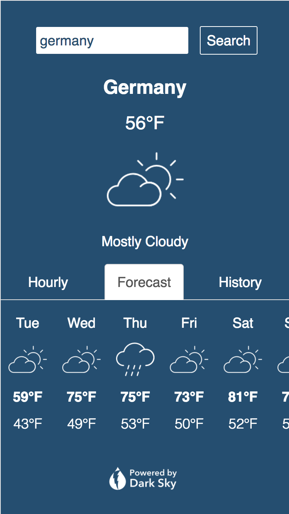

# SkyCast Weather

## About SkyCast Weather
SkyCast Weather is a full-stack mobile weather application that searches any input location, retrieves the longitude and latitude from the Google Maps API, and then fetches the weather information from the Dark Sky API. It has a react.js front-end and stores a users' search history through user authentication and a PostgreSQL database on the back-end.

## Technologies Used
- Node & Express: the app has its own server, built using Express
- MVC Pattern: the app uses the Model View Controller (MVC) programming design pattern 
- PostgreSQL/ PG-Promise: The app persists data and uses multiple PostgreSQL tables
- Google Maps API: the app uses the third party API powered by Google to allow user location search functionality
- Dark Sky API: the app uses the third party API powered by Dark Sky to retreive near real-time weather information
- Isomorphic Fetch: the app uses isomorphic-fetch to fetch the third party apis on the back-end
- Passport: passport is used to create an authentication strategy for the app
- Passport-local: is a passport strategy to set the username/password login flow
- Bcrypt: the app uses bcrypt to encrypt user passwords
- Express-session: to store user sessions on the express server
- Cookie-parser: to parse cookies
- Heroku web hosting: the app is hosted on Heroku

## Installation Instructions

1. Run `npm install` in the root folder and the client folder (each app has its own package.json and dependencies that need to be installed).
2. In the root folder, create a `.env` file. You will need to add a `SECRET_KEY` for user authentication. Set the secret key to anything you want. You will also need to add a `WEATHER_API_KEY` obtained from the [Dark Sky API](https://darksky.net/dev/) and a `GOOGLE_API_KEY` from [Google's Geocoding API](https://developers.google.com/maps/documentation/geocoding/start).
3. In psql run `create database weather_development` 
4. Run `psql -f migrations_06052017.sql` in the migrations folder in db of the root folder to create the users and users_search tables.
4. Create a `.env` file in the root. You'll need to have an `APPLICATION_ID` and `API_SECRET_KEY` for the Edamam API and a `SECRET_KEY` for user authentication. 
4. To launch the app locally run `npm run dev` in the root folder. In another terminal tab run `npm start` in the client folder.

## Unsolved Problems/Next Steps
- Automatic geo-location